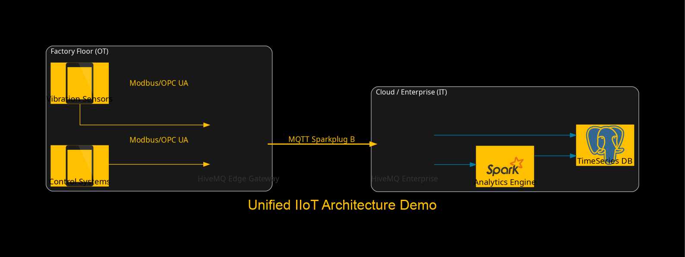

# AI-DAC: Diagrams as Code for HiveMQ

Generate professional, HiveMQ-branded architecture diagrams programmatically using Python. Built for Technical Account Managers and engineers who need version-controlled, automatically generated IoT architecture documentation.



## Features

- **Configuration-driven icons** — Define symbols in CSV, YAML, or JSON; reference them by name in your diagrams
- **HiveMQ brand theming** — Pre-configured colors, fonts, and styling matching HiveMQ brand guidelines
- **Auto-generated documentation** — Produces a Bill of Materials (BOM) table in Markdown alongside every diagram
- **234 built-in icons** — Full HiveMQ icon library in both PNG and SVG formats (`icons/PNGs/`, `icons/SVGs/`)
- **Multiple output formats** — PNG for presentations, SVG for scalable/web use
- **Git & S3 integration** — Push diagrams and docs to GitHub or host on AWS S3

## Quick Start

### Prerequisites

- **Python 3.13+**
- **Graphviz** (required by the `diagrams` library for rendering)

```bash
# macOS
brew install graphviz

# Ubuntu/Debian
sudo apt-get install graphviz

# Windows
# Download from https://graphviz.org/download/ and add to PATH
```

### Installation

```bash
git clone https://github.com/williamsommers-hmq/diagrams-as-code.git
cd diagrams-as-code

python -m venv .venv
source .venv/bin/activate

pip install -r requirements.txt
```

Or with [uv](https://docs.astral.sh/uv/):

```bash
uv sync
```

### Run the Demo

```bash
python demo.py
```

This generates `images/demo_architecture.png` — a Unified IIoT Architecture diagram with Factory Floor and Cloud clusters connected via MQTT Sparkplug B.

## How It Works

### 1. Define your icons (`icons.csv`)

Map short symbol names to icon image files:

```csv
symbol,path,notes
edge,"./icons/PNGs/Gateway.png","HiveMQ Edge Gateway"
broker,"./icons/PNGs/Platform.png","HiveMQ Platform"
sensor,"./icons/PNGs/Sensor.png","Industrial Sensor"
```

YAML and JSON formats are also supported — see `icons/icons.yaml` for an example.

### 2. Write your diagram script

```python
from diagrams import Cluster, Diagram, Edge
from hivemq_theme import HiveMQPalette, GLOBAL_ATTR, BASE_NODE_ATTR, HIVEMQ_YELLOW, DARK_GREY

palette = HiveMQPalette("icons.csv")

with Diagram("My Architecture", show=False, outformat="png", graph_attr=GLOBAL_ATTR):

    with Cluster("Factory Floor", graph_attr={"bgcolor": DARK_GREY, "fontcolor": "white"}):
        edge = palette.get_node("edge", "Plant Gateway")

    with Cluster("Cloud", graph_attr={"bgcolor": DARK_GREY, "fontcolor": "white"}):
        broker = palette.get_node("broker", "Enterprise Broker")

    edge >> Edge(label="MQTT/TLS", color=HIVEMQ_YELLOW) >> broker

palette.generate_readme("My Architecture", "my_architecture.png")
```

### 3. Run and get output

```bash
python my_diagram.py
```

This produces:
- A diagram image (PNG or SVG)
- A `README.md` with the embedded diagram and a Bill of Materials table

## Core Module: `hivemq_theme.py`

### Brand Constants

| Constant | Value | Usage |
|---|---|---|
| `HIVEMQ_YELLOW` | `#FFC000` | Primary accent, edges, highlights |
| `HIVEMQ_BLACK` | `#000000` | Backgrounds |
| `HIVEMQ_TEAL` | `#037DA5` | Secondary accent |
| `DARK_GREY` | `#181818` | Cluster backgrounds |
| `GLOBAL_ATTR` | dict | Graph-level styling (pass to `Diagram`) |
| `BASE_NODE_ATTR` | dict | Node styling (pass to standard nodes) |

### `HiveMQPalette` Class

```python
palette = HiveMQPalette("icons.csv")  # or icons.yaml, icons.json
```

| Method | Description |
|---|---|
| `get_node(symbol, label)` | Create a `Custom` diagram node using an icon from your config |
| `generate_readme(name, image_file)` | Write a `README.md` with the diagram image and BOM table |
| `push_to_github(repo_path, commit_msg)` | Commit and push all changes to the Git remote |
| `upload_to_s3(file_list, bucket, region)` | Upload files to an AWS S3 bucket |

The palette auto-bootstraps on init — if the `icons/` directory or config file is missing, it creates defaults.

## Project Structure

```
diagrams-as-code/
├── hivemq_theme.py        # Core palette class and brand constants
├── demo.py                # Main demo: Unified IIoT Architecture
├── one-click-main.py      # Minimal template for quick diagrams
├── example_runner.py      # Educational utility
├── icons.csv              # Root icon configuration (234 symbols)
├── icons/
│   ├── PNGs/              # 234 HiveMQ-branded PNG icons
│   ├── SVGs/              # Matching SVG icons
│   ├── icons.csv          # Icon config (copy)
│   └── icons.yaml         # Icon config (YAML format)
├── examples/
│   ├── basic_palette_init.py    # Minimal palette setup
│   ├── themed_main.py           # Global Data Fabric with multi-region
│   ├── diagrams-logos.py        # Mixed custom + standard library icons
│   └── old_main.py              # Multi-region disaster recovery
├── images/                # Generated diagram output
├── tests/                 # Unit tests
├── docs/                  # Architecture docs, mockups, BOM samples
├── prompts/               # AI conversation transcripts (reference)
├── Dockerfile             # Containerized execution
├── docker_compose.yml     # Docker Compose with AWS credential passthrough
├── pyproject.toml
├── requirements.txt
└── run_demo.sh            # Demo runner with venv checks
```

## Examples

| File | Description | Output Format |
|---|---|---|
| `demo.py` | Factory Floor + Cloud with Sparkplug B bridge | PNG |
| `examples/themed_main.py` | US-East / EU-West Global Data Fabric | SVG |
| `examples/diagrams-logos.py` | Mixed HiveMQ + Kafka + InfluxDB icons | PNG |
| `examples/old_main.py` | Multi-region with disaster recovery bridge | SVG |
| `one-click-main.py` | Minimal single-node template | SVG |

## Docker

Run diagram generation in a container (includes Graphviz):

```bash
docker compose build
docker compose run diagram-gen python demo.py
```

For S3 uploads, set `AWS_ACCESS_KEY_ID` and `AWS_SECRET_ACCESS_KEY` as environment variables.

## TAM Workflow

1. **Edit** `icons.csv` — add or update icon symbols as needed
2. **Write** a diagram script using `palette.get_node("symbol", "Label")`
3. **Run** the script — diagram image and BOM documentation are generated automatically
4. **Push** to GitHub — the repository README renders the diagram on the front page

## Bill of Materials

Every diagram automatically tracks which icons are used. After generation, `generate_readme()` produces a table like:

| Symbol | Label | Technical Notes |
| :--- | :--- | :--- |
| edge | HiveMQ Edge Gateway | HiveMQ Edge |
| broker | HiveMQ Enterprise | HiveMQ Platform |

## Dependencies

- [diagrams](https://diagrams.mingrammer.com/) — Python diagram generation (wraps Graphviz)
- [PyYAML](https://pyyaml.org/) — YAML config support
- [GitPython](https://gitpython.readthedocs.io/) — Git integration
- [boto3](https://boto3.amazonaws.com/v1/documentation/api/latest/index.html) — AWS S3 integration

## License

See repository for license details.
