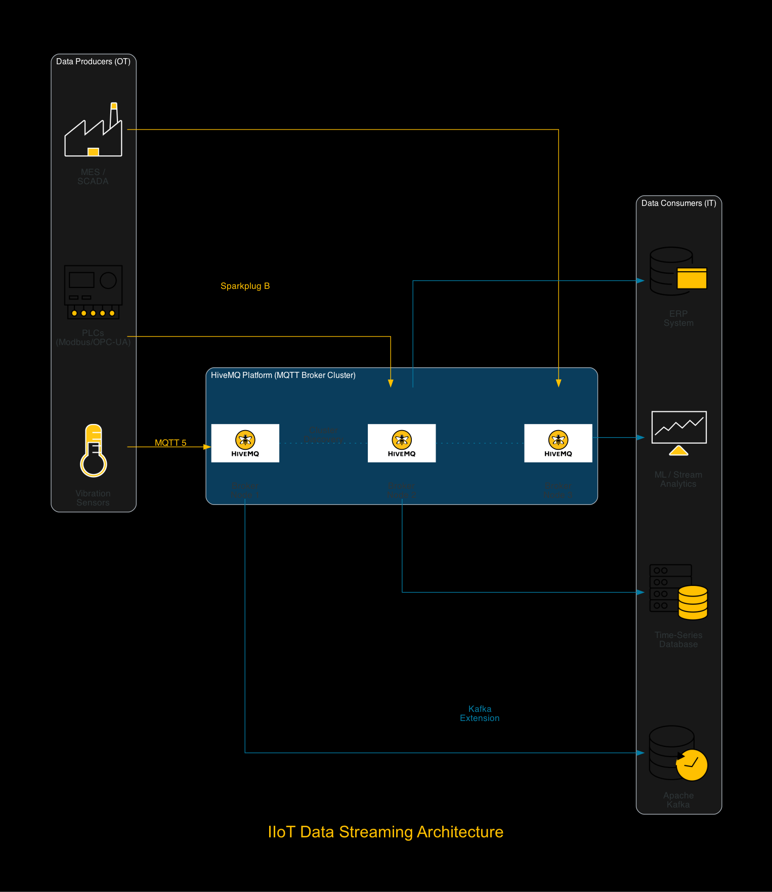
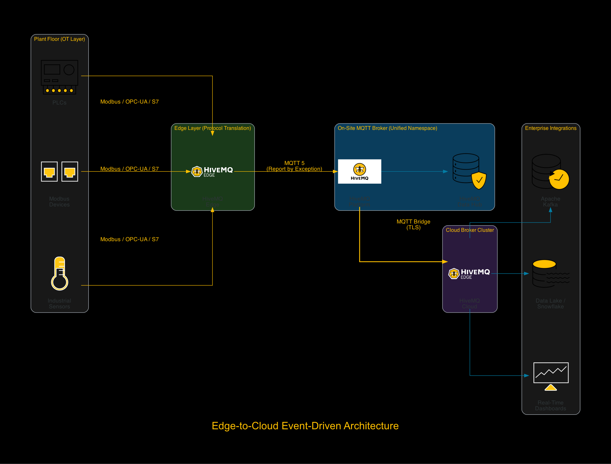
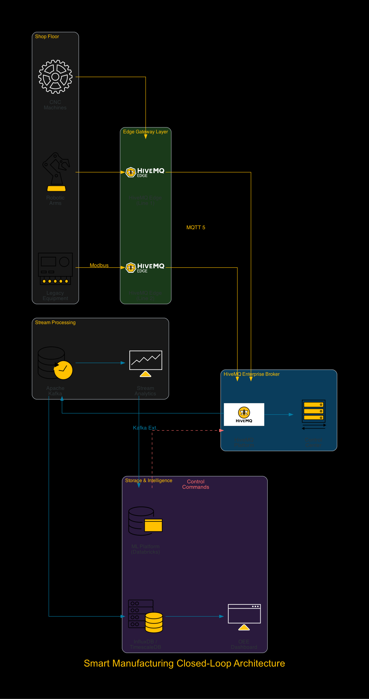
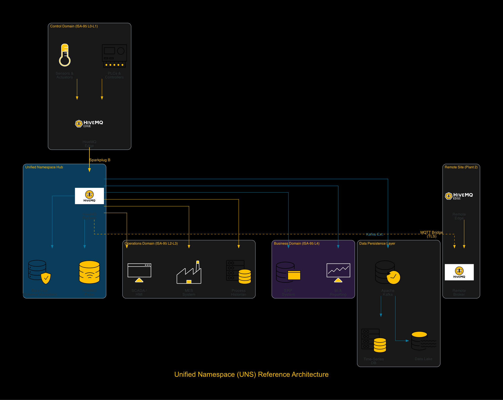
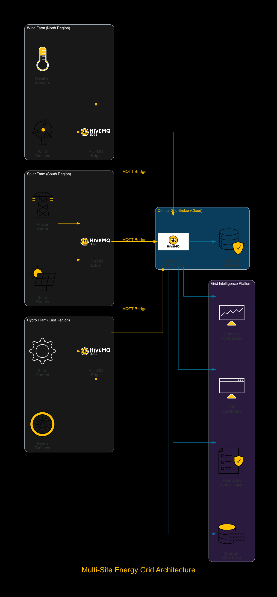

# Reference Architectures

Five HiveMQ reference architecture diagrams generated from recent [HiveMQ blog](https://www.hivemq.com/blog/) articles.

## Diagrams

### 1. IIoT Data Streaming Architecture


Three-tier MQTT streaming: Data Producers (sensors, PLCs, MES) → HiveMQ Broker Cluster → Data Consumers (Kafka, time-series DBs, analytics, ERP).

**Source:** [Building Industrial IoT Data Streaming Architecture with MQTT](https://www.hivemq.com/blog/building-industrial-iot-data-streaming-architecture-mqtt/)

---

### 2. Edge-to-Cloud Event-Driven Architecture


Four-layer architecture: Plant floor sensors → HiveMQ Edge (protocol translation) → On-site MQTT Broker (UNS hub) → MQTT Bridge → Cloud Broker → Enterprise integrations.

**Source:** [A Guide to Event-Driven Architecture for Edge-to-Cloud Connectivity](https://www.hivemq.com/blog/a-guide-event-driven-architecture-edge-to-cloud-connectivity/)

---

### 3. Smart Manufacturing Closed-Loop Architecture


End-to-end closed-loop pipeline: CNC machines → HiveMQ Edge → HiveMQ Broker → Kafka → InfluxDB → ML Platform → feedback loop back through MQTT for machine control.

**Source:** [A Practical Guide to IIoT Data Streaming Implementation in Smart Manufacturing](https://www.hivemq.com/blog/a-practical-guide-iiot-data-streaming-implementation-smart-manufacturing/)

---

### 4. Unified Namespace (UNS) Reference Architecture


Hub-and-spoke UNS with HiveMQ as the central broker. ISA-95 domains (Control, Operations, Business) publish into a shared namespace. Includes Data Hub validation, Kafka persistence, and multi-site MQTT bridging.

**Source:** [Foundations of the Unified Namespace Architecture for IIoT](https://www.hivemq.com/blog/foundations-of-unified-namespace-architecture-iiot/)

---

### 5. Multi-Site Energy Grid Architecture


Multi-site renewable energy grid: Wind farm, Solar farm, and Hydro plant each with HiveMQ Edge → central cloud broker → grid analytics, demand forecasting, and regulatory compliance. Composite architecture applying patterns from all four source articles.

## Regenerating

```bash
uv run python reference_architectures/01_iiot_data_streaming.py
uv run python reference_architectures/02_edge_to_cloud.py
uv run python reference_architectures/03_smart_manufacturing.py
uv run python reference_architectures/04_unified_namespace.py
uv run python reference_architectures/05_multi_site_energy.py
```
